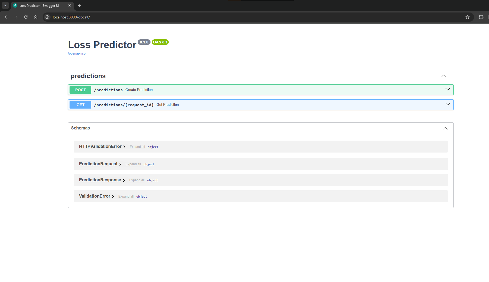

# loss_predictor

Сервис для предсказания расходов за отказ от покупки конкретного товара. Данные о заказе принимаются по HTTP, дополняются соответствующими им данными из БД, обрабатываются готовой ML-модель. Результат предсказания сохраняется в БД.

## Демонстрация



## Установка

### Локально:

1. клонирование репозитория
   git clone https://github.com/KsFomina/loss_predictor.git
   cd loss-predictor

2. Создание и активирование виртуалного окружения
   python -m venv .venv
   .venv\Scripts\Activate.ps1
   pip install -r requirements.txt

_версии из `requirements-model.txt` включены в `requirements.txt`_

3. Пример окружения
   cp .env.example .env

### Docker

docker compose up --build

_API будет доступен на http://127.0.0.1:8000/docs_

## Использование

1. Загрузка признаков товаров в БД из csv
   Перед первым запуском сервиса нужно заполнить таблицу item_features в БД данными из `artifacts/item_features.csv`

python -m app.loader artifacts/item_features.csv

Функция обновляет существующие записи по item_id, некорректные строки пропускает, если в файле несколько строк с одним item_id - при каждом вхождении обновляет уже существующую запись (т.е. в бд будет записана последняя корректная строка)

### запуск

uvicorn app.main:app --reload

_Открыть http://127.0.0.1:8000/docs_

### Пример запросов

##### POST /predictions

{
"request_id": "9e597dee-4253-4a30-8ec3-20a1cb10d56f",
"item_id": "ITEM-001",
"item_price": 2500.0,
"delivery_days": 4,
"client_is_app": true,
"type_prepayment": "card"
}

```bash
curl -X 'POST' \
  'http://localhost:8000/predictions' \
  -H 'accept: */*' \
  -H 'Content-Type: application/json' \
  -d '{
  "request_id": "9e597dee-4253-4a30-8ec3-20a1cb10d56f",
  "item_id": "ITEM-001",
  "item_price": 2500.0,
  "delivery_days": 4,
  "client_is_app": true,
  "type_prepayment": "card"
}'
```

**Ожидаемый ответ:**

```json
{
  "request_id": "9e597dee-4253-4a30-8ec3-20a1cb10d56f",
  "prediction": 501.34,
  "model_version": "1.0.0"
}
```

_request_id не генерируется автоматически, необходимо вводить его вручную._

##### GET /predictions/{request_id}

request_id: 9e597dee-4253-4a30-8ec3-20a1cb10d56f

```bash
curl -X 'GET' \
  'http://localhost:8000/predictions/9e597dee-4253-4a30-8ec3-20a1cb10d56f' \
  -H 'accept: */*'
```

Ожидаемый ответ:

```json
{
  "request_id": "9e597dee-4253-4a30-8ec3-20a1cb10d56f",
  "prediction": 501.34,
  "model_version": "1.0.0"
}
```

## Структура проекта

```
app/
  main.py        FastAPI-приложение
  config.py      настройки из переменных окружения
  database.py    engine, SessionLocal, Base
  models.py      ORM: ItemFeature, Prediction
  schemas.py     Pydantic: PredictionRequest, PredictionResponse
  ml.py          обёртка над joblib-моделью
  loader.py      загрузка item_features.csv в БД
  routes.py      POST /predictions, GET /predictions/{request_id}
artifacts/
  model.joblib
  model_metadata.json
  item_features.csv
tests/
  test_api.py
  test_loader.py
  test_full.py
Dockerfile
compose.yaml
entrypoint.sh
conftest.py
requirements.txt
requirements-model.txt
.env.example
```

## Тесты
pytest -v

Тестами покрыты следующие сценарии:

- успешное предсказание
- ошибки валидации (код 422)
- отсутствие товара в бд (код 404)
- повторный вызов на request_id - модель не будет вызвана повторной
- получение уже сохраненного результата (GET)
- загрузка CSV
- полный сценарий с настоящей моделью
